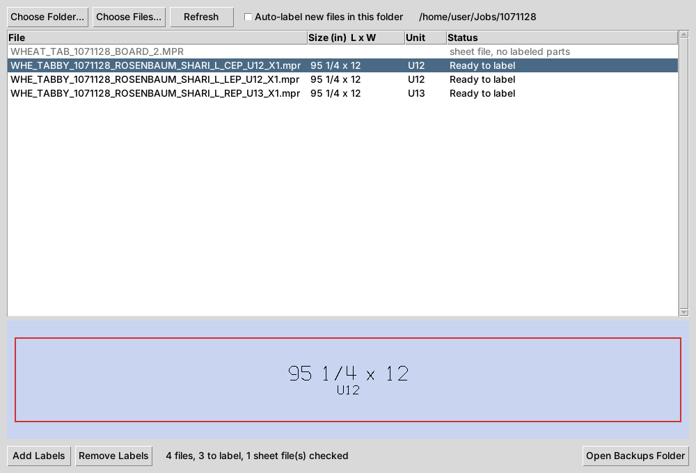

# Wood WOP Labeling

Draws each part's size (length x width, in inches) and its unit number on
woodWOP part files (`.mpr`), so they show on the part and travels with it into woodNest and
onto the sheet. **No machining changes**, and the label is **never routed**.



## What the label is

For `WHE_TABBY_1071128_ROSENBAUM_SHARI_L_CEP_U12_X1.mpr` (2419.35 x 304.8 mm):

```
95 1/4 x 12
    U12
```

- **Size**: length x width, rounded to the nearest 1/16". Read from the part's
  rough exterior size in the file.
- **Unit**: the last `U` + number in the file name after the job number
  (`..._CEP_U12_X1` -> `U12`). Drawn smaller (60%), centered under the size. If
  the file name has no unit, only the size is drawn.
- Drawn centered on the part, along its longer side. The size is up to 50 mm
  (about 2") tall and shrinks on smaller parts, down to 3 mm. The unit is left
  off if it would be under 3 mm. A part too small for the size gets the label in
  its variable list only, with no drawing.

It's written in two places, neither of which the machine runs:

1. **Drawn on the part as plain lines.** Each character is a woodWOP
   **contour**, which is just geometry. The machine only cuts a contour when a
   routing operation points at it, and **nothing ever points at these**. Each
   character is one open line that never closes, so woodNest can't mistake a
   letter for a cutout.
2. **A `LABEL` entry at the end of the part's variable list**, with the label as
   its comment (`KM="SIZE 95 1/4 x 12 | U12"`). Its value is the number of drawn
   characters. That's how the app finds the drawing again to update or remove
   it, and your checking AI can read the size here.

In the file:

```
bfb="57"
KM="bore from back"
LABEL="11"                   <- added (11 drawn characters)
KM="SIZE 95 1/4 x 12 | U12"  <- added

]1                           <- the part's own outline (unchanged)
...
]2                           <- added: drawn "9"
$E0
KP
X=...
...
]12                          <- added: drawn "2" of U12
...
<100 \WerkStck\              <- everything from here down is unchanged
...
<105 \Konturfraesen\
EA="1:0"                     <- routing still cuts only contour 1, the outline
```

## Router safety: a label is never routed

A routed label ruins the part. Before any file is saved, the app checks:

- No operation is added, and every existing operation is byte-for-byte
  unchanged and still cuts exactly the same contour as before.
- Nothing points at a label contour.

If any check fails, the file is not written. **Remove Labels** also refuses to
touch a file where something points at its label.

**Sheet files are checked too.** Any woodNest sheet file in the folder has every
operation checked. If any operation is set to cut a label (or a contour that's
missing), the sheet shows in red as **DANGER - DO NOT RUN**. Otherwise it shows
`sheet OK`, with how many labeled parts and label lines it found. Sheet files
are never changed.

## Using it

1. Download `WoodWopLabeling.exe` from the **latest** release on this repo
   (Releases, on the right side of the repo page). It's one file with no install.
   Copy it to any Windows computer.
   - Windows may warn about an unrecognized app the first time. Click
     **More info**, then **Run anyway**.
2. Open it and click **Choose Folder...** to pick the folder with the part
   files, or **Choose Files...** to pick part files. You can also drop a folder
   onto the exe's icon.
3. The list shows each file's label and status. Click a row to see the label
   drawn on the part.
4. Click **Add Labels**. Each file is saved back **in its own folder under the
   same name**.

**Auto-label (drop files in, they come out labeled):** after choosing a folder,
tick **Auto-label new files in this folder**. While the window stays open:

- Every part file in that folder that isn't labeled yet gets labeled and saved.
  That covers files already there and any new ones copied in.
- A file is only touched once it has stopped changing for 3 seconds and is
  complete, so files are never labeled mid-save.
- Sheet files are only checked.

**Safety**

- Before a file is replaced, the original is copied to
  `Documents\WoodWOP Label Backups\<date and time>\`.
- A file that already has the right label is left alone. Running it twice is safe.
- If a part's size or file name (unit) changes, its label is updated.
- If the size in the file header doesn't match the part's own size settings,
  the file is skipped and marked as a problem. A stale header could otherwise
  give a wrong label.
- **Remove Labels** takes the label back out. The file returns to exactly its
  original bytes.
- Files labeled by any earlier version are upgraded to the current label
  automatically.

## For developers

- `woodwop_label.py`: labeling logic, plus a command line
  (`python woodwop_label.py --dry-run <folder>`).
- `stroke_font.py`: the single-line font and label layout.
- `app.py`: the window app.
- `tests/`: run `python -m pytest`. Tests use the real files in `samples/`, and
  files from the earlier test versions in `tests/fixtures/`.
- `.github/workflows/build.yml`: builds the exe on Windows, runs the tests and
  an end-to-end self-test of the exe (button and auto-label), then publishes it
  to the `latest` release.
